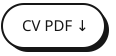
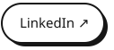

<picture><source media="(prefers-color-scheme: dark)" srcset="assets/hero-dark.svg" /></picture>

<a href="https://www.kevinmathew.co.uk"><picture><source media="(prefers-color-scheme: dark)" srcset="assets/btn-site-dark.svg" /></picture></a>
<a href="https://www.kevinmathew.co.uk/kevin-john-mathew-resume.pdf"><picture><source media="(prefers-color-scheme: dark)" srcset="assets/btn-resume-dark.svg" /></picture></a>
<a href="https://www.linkedin.com/in/kevinjohnmathew"><picture><source media="(prefers-color-scheme: dark)" srcset="assets/btn-linkedin-dark.svg" /></picture></a>
<a href="mailto:kevinmathew2424@gmail.com"><picture><source media="(prefers-color-scheme: dark)" srcset="assets/btn-email-dark.svg" /></picture></a>
<picture><source media="(prefers-color-scheme: dark)" srcset="assets/btn-views-dark.svg" /></picture>

I build enterprise software that connects traditional .NET systems with modern AI capabilities — from custom model training to production-grade backend integration.

 

<picture><source media="(prefers-color-scheme: dark)" srcset="assets/work-head-dark.svg" /></picture>
<a href="https://github.com/kevin-john-mathew/clim8"><picture><source media="(prefers-color-scheme: dark)" srcset="assets/work-clim8-dark.svg" /></picture></a>
<a href="https://github.com/kevin-john-mathew/play-music"><picture><source media="(prefers-color-scheme: dark)" srcset="assets/work-play-music-dark.svg" /></picture></a>
<a href="https://github.com/kevin-john-mathew/3d-portfolio"><picture><source media="(prefers-color-scheme: dark)" srcset="assets/work-3d-portfolio-dark.svg" /></picture></a>
<a href="https://github.com/kevin-john-mathew/celestial-objects"><picture><source media="(prefers-color-scheme: dark)" srcset="assets/work-celestial-objects-dark.svg" /></picture></a>

 

<picture><source media="(prefers-color-scheme: dark)" srcset="assets/stack-dark.svg" /></picture>

  

<a href="mailto:kevinmathew2424@gmail.com"><picture><source media="(prefers-color-scheme: dark)" srcset="assets/footer-dark.svg" /></picture></a>
